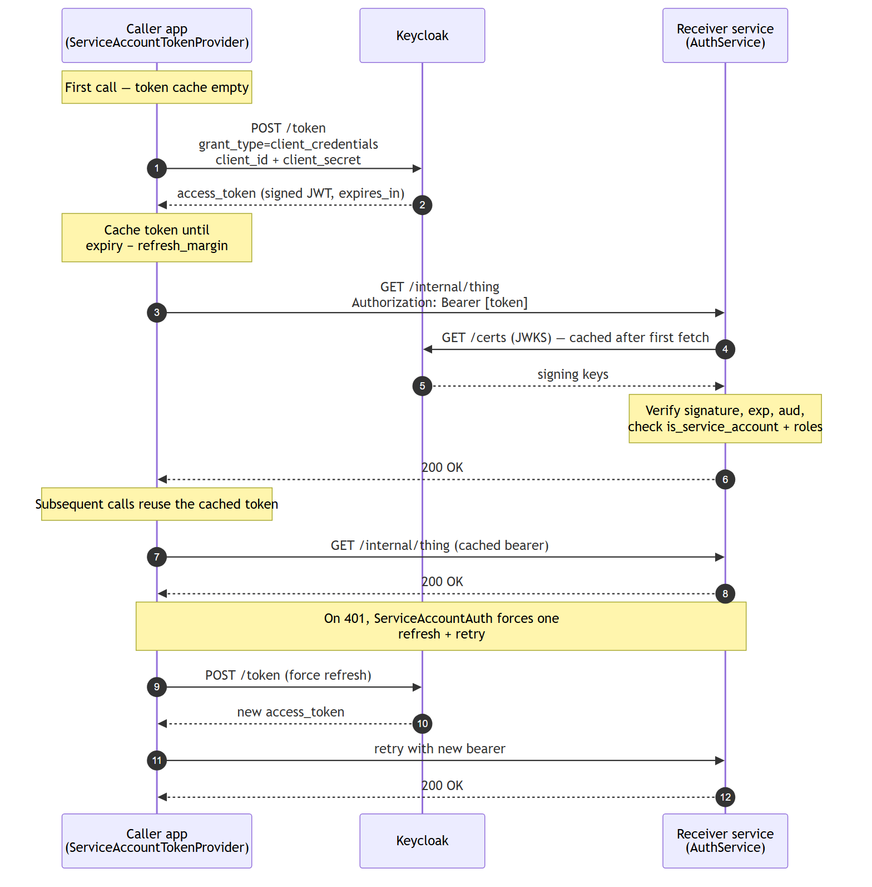

# Service-to-service auth (Keycloak service accounts)

For machine-to-machine calls — a backend app (the **caller**) making an
authenticated request to another service (the **receiver**) — use Keycloak
**service accounts** with the OAuth2 *client credentials* grant. The caller
authenticates to Keycloak with its `client_id` + `client_secret`, gets a signed
JWT, and sends it as a normal bearer token. The receiver validates it exactly
like a user token.

## Flow


## Keycloak setup (one-time)

1. Create a **confidential** client for the caller and enable **Service
   Accounts** (client authentication on; standard/direct-access flows off is
   fine).
2. Under the client's **Service account roles**, assign the realm or client
   role the receiver will require (e.g. a realm role `service`, or a client role
   on the receiver's client). This is how you authorize *which* service may do
   *what* — the token carries these roles under `realm_access`/`resource_access`
   just like a user's.

## Caller side — obtain and attach a token

`ServiceAccountTokenProvider` performs the client-credentials grant, caches the
access token in memory, and refreshes it shortly before expiry. Get an
`httpx.Auth` from it via `.auth()` so tokens are attached automatically (and a
`401` triggers one forced refresh + retry).

```python
import httpx
from newsquawk_auth import ServiceAccountTokenProvider

provider = ServiceAccountTokenProvider(
    token_url=settings.keycloak_token_url,   # .../realms/<realm>/protocol/openid-connect/token
    client_id=settings.service_client_id,
    client_secret=settings.service_client_secret,
    # scope="...", audience="receiver-api",  # optional
)

# Async (recommended inside FastAPI) — reuse one provider for the app's lifetime
async with httpx.AsyncClient(auth=provider.auth()) as client:
    resp = await client.get("https://other-service/internal/thing")

# Sync
resp = httpx.get("https://other-service/internal/thing", auth=provider.auth())

# Or get the raw token yourself
token = await provider.get_token_async()   # or provider.get_token()
```

Create **one** provider per client and reuse it (module-level singleton or on
`app.state`) so the token cache is shared across requests.

## Receiver side — authorize the caller

The receiver validates the token with the same `AuthService`. The **primary**
authorization mechanism is a role check on the service account:

```python
# Require the 'service' realm role that you assigned to the caller's service account
@app.post("/internal/thing")
async def internal_thing(_: Annotated[None, Depends(auth_deps.has_realm_role("service"))]):
    return {"ok": True}
```

To additionally assert the caller is a service account (not an interactive user)
— optionally a *specific* client — use `require_service_account`. It returns the
calling client's ID:

```python
# Any service account
@app.post("/internal/a")
async def a(client_id: Annotated[str, Depends(auth_deps.require_service_account())]):
    return {"called_by": client_id}

# Only a specific client
@app.post("/internal/b")
async def b(_: Annotated[str, Depends(auth_deps.require_service_account(client_id="app-a"))]):
    return {"ok": True}
```

`CurrentUser` also exposes `is_service_account` and `client_id` for inline
checks. Combine a role dependency with `require_service_account` when you want
both "is a service account" and "has role X".

> Service-account detection keys off Keycloak's `preferred_username` of the form
> `service-account-<client-id>`; the client ID comes from the `azp` claim.

## API Reference (service-account additions)

These build on the core API documented in the [main README](../README.md#api-reference).

### AuthService

- `extract_client_id(token_data)` - Get the calling client's ID (`azp`) — set for service-account tokens
- `is_service_account(token_data)` - Whether the token is a Keycloak service account

### AuthDependencies

- `require_service_account(client_id=None)` - Dependency requiring a service-account token, optionally for a specific client (returns the calling client's ID)

### CurrentUser

- `client_id` - Calling client's ID (`azp`) — set for service-account tokens
- `is_service_account` - Whether this token belongs to a Keycloak service account

### Convenience Functions

- `require_service_account(auth_service, client_id=None)` - Create a service-account guard dependency

### ServiceAccountTokenProvider (caller side)

Obtains and caches Keycloak service-account tokens via the client-credentials grant.

```python
provider = ServiceAccountTokenProvider(token_url, client_id, client_secret)
```

- `get_token(force_refresh=False)` - Return a valid access token (sync), fetching/refreshing as needed
- `get_token_async(force_refresh=False)` - Async variant
- `auth()` - Return an `httpx.Auth` (`ServiceAccountAuth`) that attaches the token to outgoing requests

Constructor options: `scope`, `audience`, `refresh_margin` (default 30s), `timeout` (default 10s), `verify` (TLS). Raises `ServiceAccountError` when a token can't be obtained.
